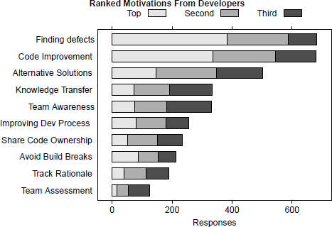
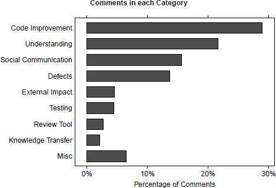
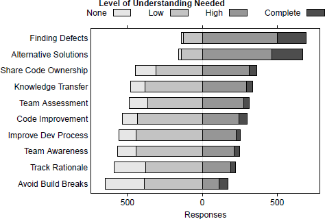

## **SEÇÃO 1 - INTRODUÇÃO**

- Revisão de código em pares é reconhecida como uma ferramenta importante para redução de defeitos melhora de qualidade de projetos de software.

- 1976: Fagan formalizou um processo altamente estruturado de revisão de código, baseado em revisões linha a linha feitas em grupos, com reuniões extensas.

- Durante anos pesquisadores proveram evidências dos benefícios da inspeção do código, porém a sua adoção é dificultada pela sua forma de abordagem complexa e lenta.

- Muitas organizações atualmente adotam práticas de code review mais leves, de forma a limitar as ineficiências dessas inspeções, uma dessas é a utilização de ferramentas de code review.

- A revisão de código moderna pode ser definida como informal, baseada em ferramentas e como prática regular em grandes empresas.

- Resultados da investigação mostram que a motivação principal do code review é achar defeitos, porém na prática relatos de defeitos são a menor parte dos comentários, o que mais ocupa a revisão são pequenos problemas de lógica de baixo nível. Por outro lado, a revisão proveem muitos benefícios às equipes, como transferência de conhecimento, conscientização e melhora na solução de problemas.

- De acordo com os resultados esperados, desenvolvedores empregam muitos mecanismos para cumprir as necessidades de entendimento, maioria das quais não são atendidas por ferramentas.

## **SEÇÃO 2 - ESTUDOS ANTERIORES**

- Stein et al. conduziu um estudo focando em inspeção de código distribuida e assíncrona, com inclusão de uma ferramenta que permitia a identificação e compartilhamento de falhas ou defeitos no código.

- Laitenburger conduziu um questionário de métodos de inspeção de código, e apresentou a taxonomia das técnicas de inspeção.

- Johnson conduziu uma investigação de revisão de código em desenvolvimento open source e seus efeitos nas escolhas feitas por gerentes de projetos de software.

- Porter et al. reportaram uma revisão de estudos de revisão de código que examinou efeito de fatores como tamanho de equipe, tipo de review, número de sessões e inspeções de código. Também avaliaram custos e benefícios em vários estudos. Estes foram majoritariamente estudos envolvendo reuniões planejadas de discussão de código, sem uso de ferramentas.

- Pesquisas anteriores mostram também por que das revisões atuais serem informais, e algumas vezes assíncronas, sendo a principal causa o tempo requerido pra inspeções formais. Votta descobriu que 20% do intervalo em uma "inspeção tradicional" é desperdiçada por agendamento.

- A ferramenta ICICLE (Intelligent Code Inspection in a C Language Environment) foi desenvolvida após desenvolvedores da Bellcore observarem quanto tempo e trabalho era usado antes e durante uma inspeção formal. Muitas das ferramentas de review atuais são basedas nas ideias dela.

- Rigby teve extenso trabalho examinando prátivas de revisão em desenvolvimento de softwares open source. Por exemplo, em um estudo de práticas no projeto Apache, mineraram arquivos de email e descobriram que as revisões eram, tipicamente, pequenas e frequentes, e que contribuições para a revisão eram frequentemente breves e independentes umas das outras.

- Sutherland e Venolia levantaram a hipótese que a troca de conhecimento durante as revisões pode ser de grande valor para que engenheiros posteriormente tentassem entender ou modificar o código discutido. De acordo com eles, **"as revisões de código são uma oportunidade atraente para capturar a justificativa do projeto"**.

- Em um estudo de hábitos de trabalho, Latoza et al. descobriram que muitos problemas encontrados por desenvolvedores eram relacionados ao entendimento racional por trás das mudanças de código e à obtenção de conhecimento de outros membros do time.

## **SEÇÃO 3 - METODOLOGIA**

- 4 motivos surgiram dentre os entrevistados para a pergunta "O que você espera alcançar ao enviar uma revisão de código?": encontrar defeitos, manter a equipe informada, melhorar a qualidade de código e avaliar o projeto de alto nível.

- Foram executadas diferentes formas de pesquisa, essas sendo: observações e entrevistas com desenvolvedores, classificação de cartas (técnica de ordenação amplamente utilizada em arquitetura da informação para criar modelos mentais e derivar taxonomias a partir de dados de entrada), diagrama de afinidade e pesquisas com desenvolvedores e gerentes.

## **SEÇÃO 4 - POR QUE PROGRAMADORES FAZEM CODE REVIEW?**

- O comentário de um desenvolvedor sênior sumarizou muitas das respostas para o por quê fazer code review: "A revisão de código também tem diversas influências benéficas: (1) torna as pessoas menos protetoras em relação ao seu código, (2) permite que outra pessoa entenda o código, resultando em (3) melhor compartilhamento de informações entre a equipe, (4) ajuda a promover convenções de codificação na equipe e (5) contribui para a melhoria do processo geral e da qualidade do código."

  ## **4.A - ENCONTRAR DEFEITOS**
  - 44% dos gerentes incluidos na pesquisa colocam a busca por defeitos como a principal motivação para as revisões de código, tanto para defeitos de baixo nivel (lógica), quanto de alto nível (erros de design e entre outros).
  - 383 dos programadores (44%) colocaram a busca por defeitos em primeira prioridade, 204 (23%) em segunda e 96 (11%) em terceira.

  ## **4.B - MELHORIA DE CÓDIGO**
  - Envolve melhorias em código que não envolvem correções ou defeitos, como melhora na leitura, comentários, consistência, remoção de código não usado e etc.
  - Para 337 programadores (39%) essa é a primeira prioridade na revisão de código, para 208 (24%) é a segunda e para 135 (15%) é a terceira.
  - Em 51 casos (31%), gerentes reportaram a melhoria de código como motivação primária.
  - Entrevistas deram uma ideia da conexão entre a qualidade das revisões de código e os comentários de melhoria do código. Parece ser mas fácil e rápido fazer comentários sobre convenções de equipe, para evitar passar muito tempo conduzindo uma boa revisão de código.

  ## **4.C - SOLUÇÕES ALTERNATIVAS**
  - Soluções alternativas consideram alterações e comentários sobre como aprimorar o código submetido, adotando uma ideia que leve a uma melhor implementação.
  - Para 147 programadores (17%) essa é a primeira prioridade na revisão de código, para 202 (23%) é a segunda e para 152 (17%) é a terceira.
  - Em apenas 4 casos (2%) gerentes a mencionaram como motivação primária.

  ## **4.D - TRANSFERÊNCIA DE CONHECIMENTO**
  - De acordo com os entrevistados, a revisão de código é uma oportunidade de aprendizado tanto para o autor do código quanto para os revisores. Além disso, as revisões de código são reconhecidas por educar novos desenvolvedores sobre escrita de código.
  - Gerentes incluiram esse tópico como um dos motivos para a revisão de código, embora nunca como a principal motivação.
  - Para 73 programadores (8%) essa é a primeira prioridade na revisão de código, para 119 (14%) é a segunda e para 141 (16%) é a terceira.

  ## **4.E - CONSCIÊNCIA E TRANSPARÊNCIA DA EQUIPE**
  - Gerentes frequentemente mencionavam o conceito de conscientização da equipe como uma motivação para a revisão de código, justificando-a muitas vezes com a noção de "transparência": a equipe não só deve estar ciente da direção tomada pelo código, como também ninguém deve ter permissão para fazer alterações "secretamente" que possam quebrar o código ou alterar funcionalidades.
  - Os 873 programadores que responderam à pesquisa classificaram a conscientização e a transparência da equipe como fatores muito próximos da transferência de conhecimento.
  - Para 75 programadores (9%) essa é a primeira prioridade na revisão de código, para 108 (12%) é a segunda e para 149 (17%) é a terceira.
  - **Embora esse tópico tenha aparecido nos dados finais dessa pesquisa como clara promoção pela revisão de código, pesquisas acadêmicas parecem ter dado pouca atenção a esse assunto.**

  ## **4.F - COMPARTILHAR A PROPRIEDADE DO CÓDIGO**
  - Esse conceito está intimamente ligado ao tópico anterior, porém tem foco maior em colaboração ativa e atividades de codificação sobrepostas. Logo, a revisão não serve apenas para conscientizar o time, serve também como meio para ter mais pessoas com conhecimento sobre partes específicas da base de código.
  - Desenvolvedores e gerentes também acreditam que as revisões melhoram a percepção dos membros da equipe sobre a propriedade compartilhada do código.
  - Para 51 programadores (6%) essa é a primeira prioridade na revisão de código, para 100 (11%) é a segunda e para 91 (10%) é a terceira.

  ## **4.F - RESUMO**
  - Na figura abaixo, a barra branca representa o número de desenvolvedores que colocaram esse tópico como sua principal motivação, a barra cinza representa a segunda motivação e a barra preta a terceira motivação.

  

  > **Figura 1:** Motivação dos desenvolvedores para a revisão de código.  
  > **Fonte:** Adaptado de Bacchelli & Bird (ICSE 2013) — _Expectations, outcomes, and challenges of modern code review_.

## **SEÇÃO 5 - RESULTADOS DAS REVISÕES DE CÓDIGO**

- Separação em duas seções.

  ## **5.A - MOTIVAÇÕES VS. RESULTADOS**
  - Foi conduzida uma pesquisa de campo indireta com análise de conteúdo de 200 threads (570 comentários) gravados no CodeFlow (ferramente de revisão de código).

  - Melhorias no código: categoria mais frequente, com 165 (29%) comentários. 58 deles sobre usar melhores práticas de codificação, 55 em remover códigos desnecessários ou não usados e 52 em melhorar a legibilidade do código.
  - Busca de defeitos: embora seja a motivação primária dentre os entrevistados, essa categoria é apenas a quarta mais frequente dentre nove itens, com 78 (14%) comentários. 65 deles sendo de erros lógicos, 6 de erros de alto nível, 5 de segurança e 3 de tratamento incorreto de exceções.
  - Transferência de conhecimento: 12 comentários foram encontrados sobre essa categoria, sendo ele um direcionamento do autor do código para sites externos com documentações para aprender a lidar com alguns problemas.

  

  > **Figura 2:** Proporção de comentários por categoria de classificação de cartões.  
  > **Fonte:** Adaptado de Bacchelli & Bird (ICSE 2013) — _Expectations, outcomes, and challenges of modern code review_.

  ## **5.B - IDENTIFICANDO DEFEITOS: QUANDO AS EXPECTATIVAS NÃO CORRESPONDEM À REALIDADE**
  - A maioria dos comentários sobre defeitos diz respeito a erros lógicos simples, como casos extremos, valores de configuração comuns ou precedência de operadores.
  - Dentre os dados das entrevistas, é possivel visualizar que:
    - 1 - A maioria dos defeitos encontrados em uma revisão de código com ferramentas é sobre possíveis erros lógicos;
    - 2 - Alguns entrevistados reclamaram que a qualidade das revisões é baixa porquê revisores apenas olham erros fáceis, como formatação de código, por exemplo;
    - 3 - Outros entrevistados admitem que procuram apenas por "bugs óbvios" quando o código não faz parte de sua base de códigos.
  - Gerentes mencionaram "encontrar cedo bugs óbvios" e "encontrar ineficiências e erros óbvios" como razões para fazer revisões.
  - Esse pontos reforçam a razão para que a distância entre o número de comentários entre melhora de código e busca de defeitos seja a evidência adicional de que o resultado das revisões de código não batem com a expectativa principal dos entrevistados de encontrar defeitos.

## **SEÇÃO 6 - QUAIS SÃO OS DESAFIOS DA REVISÃO DE CÓDIGO**

- Separação em seções.

  ## **6.A - REVISÃO DE CÓDIGO É ENTENDIMENTO**
  - Muitos entrevistados notaram que o entendimento é o principal desafio nas revisões de código.
  - Para muitos desenvolvedores, a descrição textual da mudança de código não é o suficiente.

  

  > **Figura 2:** sobre o nível de compreensão do código para os resultados da revisão de código.  
  > **Fonte:** Adaptado de Bacchelli & Bird (ICSE 2013) — _Expectations, outcomes, and challenges of modern code review_.
  - Nos comentários de revisões, a segunda categoria mais frequente é sobre entendimento, seja para clarificações do código ou dúvidas dos revisores quanto às alterações.
  - 91% dos entrevistados (798) responderam positivamente para a questão se toma mais tempo fazer revisões de arquivos que não estão familiarizados,
  - 82% dos entrevistados (716) também responderam positivamente ao questionamento de se os revisores familiarizados com os arquivos da revisão tem feedback diferente quanto ao tempo consumido nela, quando o revisor tem conhecimento sobre do que se trata o arquivo sendo modificado, os comentários da revisão tendem a terem "detalhes mais profundos" a serem "mais direcionados" e etc.

  ## **6.B - LIDANDO COM AS NECESSIDADES DE COMPREENSÃO**
  - Revisores tomam caminhos diferentes para entender o contexto das mudanças.
  - Todas ferramentas de código que vemos em prática entregam apenas suporte básico para entendimento que os revisores precisam.

## **SEÇÃO 7 - RECOMENDAÇÕES E IMPLICAÇÕES**

- Separação em seções.

  ## **7.A - RECOMENDAÇÕES PARA PROFISSIONAIS**
  - **Garantia de Qualidade:** Confiar na revisão de código para identificar defeitos pode ser problemático, visto que há uma clara discrepância entre a expectativa e realidade dos resultados dela.
  - **Entendimento:** Quando os revisores tem conhecimento prévio do contexto e do código, eles completam as verisões mais rapidamente e com feedback de maior valor. Os times deveriam mirar em expandir o conhecimento dos desenvolvedores e os autores das alterações devem sempre que possível escolher o proprietário do código outros que tenham o máximo de conhecimento sobre o assunto quando o objetivo é encontrar defeitos. Desenvolvedores citam também que, quando o revisor sabia do código ele fornecia melhor contexto e direção nos questionamentos, fazendo com que eles conseguissem responder melhor e de forma mais rápida.
  - **Além da identificação de defeitos:** Revisões de código modernas proveem mais que apenas achar defeitos. Ela pode ser usada para melhorias de código, soluções alternativas, melhorias no aprendizado, compartilhar propriedade de código, etc.
  - **Comunicação:** Mesmo com os benefícios das ferramentas de revisão de código, os desenvolvedores ainda precisam ter uma boa comunicação ao invés de depender apenas de comentários de explicação nas revisões.

  ## **7.B - IMPLICAÇÕES PARA OS PESQUISADORES**
  - **Automatização de tarefas de revisão:** Ferramentas que reforçam as convenções de código do time, checam typos e identificam código não usado já existem para solucionar grande parte do comentários dos revisores, de melhorias de código e de defeitos em baixo nível. Automatizar essas tarefas libera o revisor para fazer uma análise mais detalhada, de forma a encontrar defeitos mais sutís.
  - **Compreensão do programa na prática:** IDEs modernas já vêm com diversas ferramentas para auxiliar na compreensão do contexto, e existe uma conferência inteira (a ICPC) dedicada à compreensão de código, porém todas ferramentas de revisão apresentam ao revisor apenas a visualicação das diferenças nos arquivos alterados.

## **SEÇÃO 8 - LIMITAÇÕES**

- Forte concordância entre múltiplas fontes sobre as expectativas coletadas dos entrevistados, dos gerentes e dos desenvolvedores.

## **SEÇÃO 9 - CONCLUSÃO**

- Entendimento é um componente essencial nas revisões de código.
